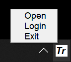

# tray-launcher-4-spring-boot
A simple tool to use a Tray Launcher for Spring Boot Applications

## HowTo
* Add the tray launcher dependency to maven ..
```xml
<repositories>
	<repository>
		<id>gh-fuchss</id>
		<name>GitHub Maven Packages</name>
		<url>https://nexus.fuchss.org/repository/github/</url>
	</repository>
</repositories>
<dependencies>
  <dependency>
    <groupId>org.fuchss</groupId>
    <artifactId>tray-launcher-4-spring-boot</artifactId>
    <version>0.1</version>
  </dependency>
</dependencies>
```
* Create a simple configuration that contains at least the name, default url, and icon of your project:
```java
SpringBootTrayLauncherConfiguration conf = new SpringBootTrayLauncherConfiguration(
  "Name", 
  "http://localhost:8080", 
  Main.class.getResourceAsStream("/icon.jpg")
);
```
* Modify your main class:
```java
@SpringBootApplication
@EnableAutoConfiguration
public class Main {
	public static void main(final String[] args) {
		// Replace SpringApplication.run(Main.class, args) by this ..
		SpringBootTrayLauncherConfiguration conf = new SpringBootTrayLauncherConfiguration("Name", "http://localhost:8080", Main.class.getResourceAsStream("/icon.jpg"));
		// You may add additional Urls for the launcher
		conf.setAdditionalUrls(List.of(new URLEntry("Login", "http://localhost:8080/login")));
		SpringBootTrayLauncher.run(Main.class, args, conf);
	}
}
```
* Now you can start your application and use a simple tray icon :) 


